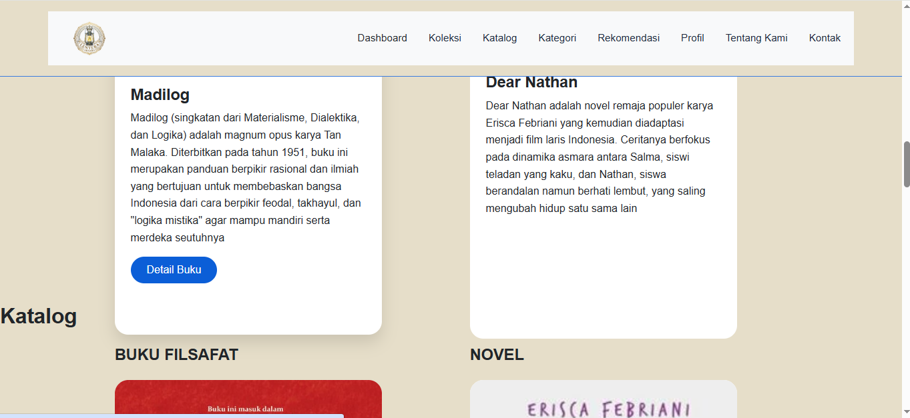
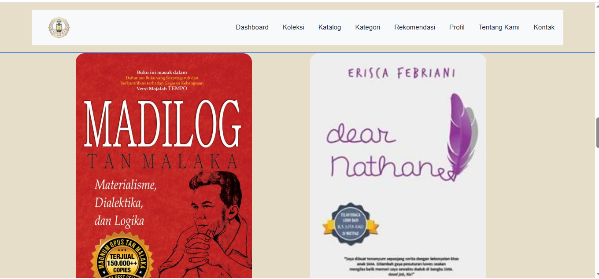
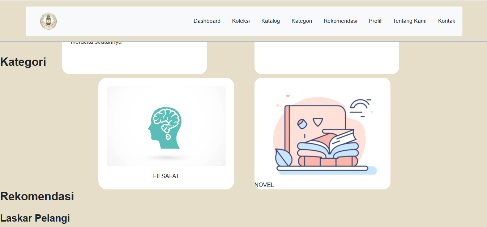
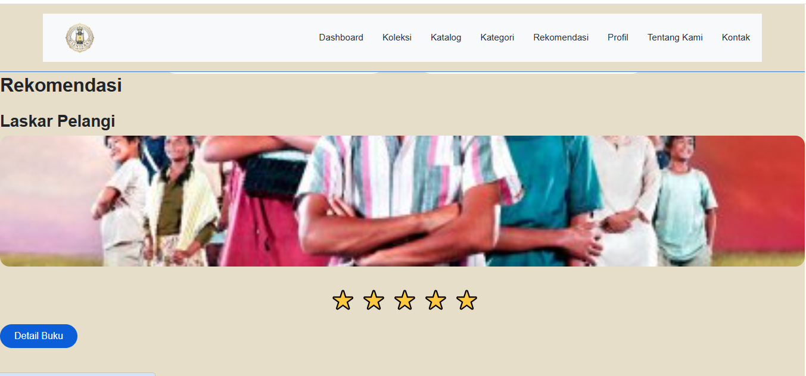
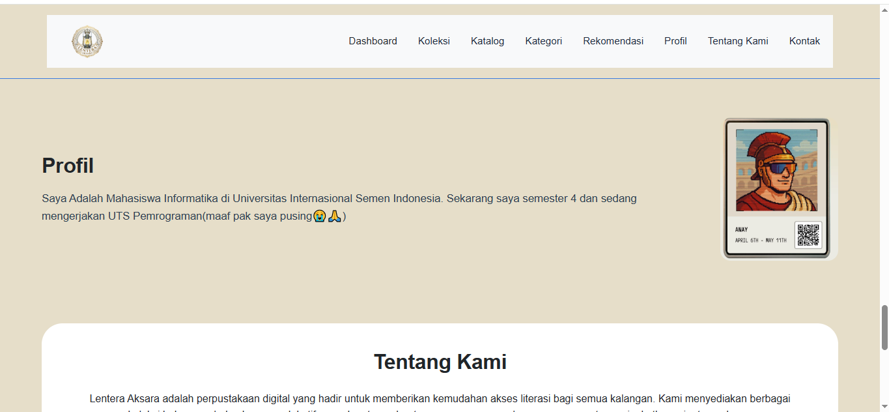
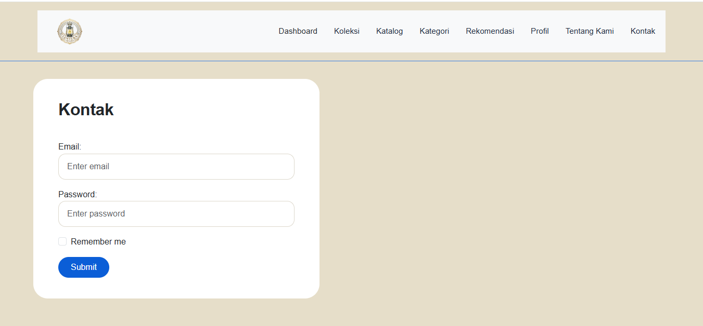

# UTSWeb_Class_0066
Lentera Aksara: website company profile perpustakaan digital

<!-- referensi -->
https://www.w3schools.com/bootstrap5/bootstrap_containers.php
-digunakan sebagai referensi awal, dimodifikasi pada tat letak responsif dan efek hover.

https://getbootstrap.com/docs/5.3/
-Desain dimodifikasi pada bagian warna (dari tema default Bootstrap menjadi tema krem #E6DEC9 dan biru tua #2c3e66), layout (penyesuaian grid dan card), konten (sesuai tema perpustakaan digital), serta fitur interaktif (pencarian, rating bintang, validasi form).

https://developer.mozilla.org/en-US/docs/Web/CSS/Guides/Flexible_box_layout
- Referensi untuk mengatur layout flex pada section Profil dan Dashboard. Dimodifikasi pada pengaturan gap, alignment, dan wrap.

https://developer.mozilla.org/en-US/docs/Web/API/Document_Object_Model
- Referensi untuk manipulasi DOM seperti filter data, perubahan style, dan event handling. Dimodifikasi untuk fitur search dan validasi form.

https://www.w3schools.com/howto/howto_css_star_rating.asp
-  Inspirasi desain rating bintang. Dimodifikasi pada arah (rtl), ukuran font, dan warna aktif (kuning).

https://fonts.google.com/specimen/Inter
-Font utama website. Dimodifikasi pada ukuran dan ketebalan untuk heading dan teks.

Tampilan Website 
1. Dashboard
![Dashboard] (Dashboard.png)
2. Koleksi 

3. Katalog

4. Kategori

5. Rekomendasi

6. Profil 

7. Tentang Kami 
![Tentang Kami] (TentangKami.png)
8. Kontak 
